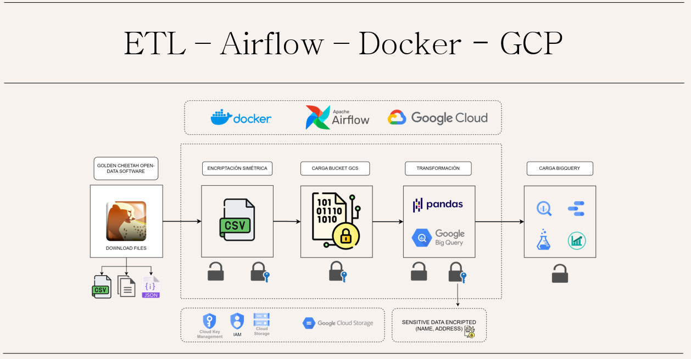

# Proyecto ETL para Encriptar y Desencriptar Datos Sensibles de Ciclistas con Airflow y GCP

Este proyecto utiliza Docker, Airflow y servicios de Google Cloud Platform (GCP) para encriptar y desencriptar datos sensibles de ciclistas. La encriptación de datos es crucial para proteger la privacidad de los usuarios y cumplir con las regulaciones de protección de datos.

## Descripción

El proyecto realiza las siguientes tareas:

1. **Encriptación:** Encripta los datos originales de los ciclistas para proteger su información personal.
2. **Carga a Google Cloud Storage:** Almacena los datos encriptados en un bucket de Google Cloud Storage para su posterior procesamiento.
3. **Eliminación de datos no encriptados:** Elimina los archivos originales no encriptados para garantizar la seguridad de los datos.
4. **Transformación y encriptación selectiva:** Realiza transformaciones en los datos (por ejemplo, eliminación de valores nulos) y luego encripta solo las columnas sensibles (como nombre y dirección).
5. **Carga a BigQuery:** Carga los datos transformados y encriptados a un Data Warehouse en BigQuery para su análisis y visualización.

## Tecnologías utilizadas

* **Python:** Lenguaje de programación principal.
* **Docker:** Para crear un entorno de ejecución aislado y reproducible.
* **Airflow:** Para orquestar y programar las tareas del flujo de trabajo ETL.
* **Google Cloud Storage:** Para almacenar los datos encriptados.
* **BigQuery:** Para almacenar y analizar los datos transformados.

## Instalación y uso

[Video sobre Instrucciones detalladas sobre cómo configurar y ejecutar el proyecto]

